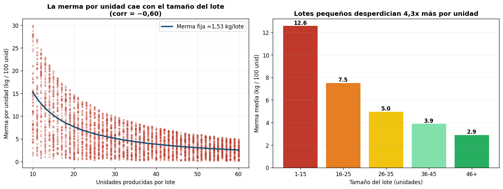

# Análisis de Producción — Pastelería

**Pregunta de negocio:** ¿Dónde estamos perdiendo más producto, y por qué?

**Datos:** 3.820 lotes de producción, un año completo (jun-2025 a jun-2026), 8 productos en 3 familias, 133.084 unidades producidas y 5.841 kg de merma total.

---

## Hallazgo principal: la merma no está donde se esperaba

La hipótesis inicial era que la merma se concentraba en algún turno, familia o producto. Los datos lo descartan: todos esos cortes son prácticamente planos.

| Corte | Merma (kg / 100 unidades) |
|---|---|
| Bizcochos | 4,48 |
| Hojaldres | 4,36 |
| Masas Quebradas | 4,33 |
| Turno Tarde | 4,46 |
| Turno Mañana | 4,32 |
| Mejor producto (Croissant) | 4,01 |
| Peor producto (Red velvet) | 4,67 |

La diferencia entre el mejor y el peor producto es de apenas 0,66 kg/100u. Ni el turno, ni la familia, ni el producto, ni el tiempo de horneado explican la merma (la correlación horneado–merma es ≈0). Optimizar por cualquiera de esas vías daría casi nada.

## El verdadero driver: el tamaño del lote

La merma por lote es **casi fija (~1,53 kg), sin importar cuántas unidades se produzcan**. Como ese desperdicio se reparte entre menos unidades, los lotes pequeños son enormemente más ineficientes por unidad.

| Tamaño del lote | N° lotes | Merma (kg / 100 unidades) |
|---|---|---|
| 1–15 unidades | 480 | **12,6** |
| 16–25 | 748 | 7,5 |
| 26–35 | 754 | 5,0 |
| 36–45 | 726 | 3,9 |
| 46+ | 1.112 | **2,9** |

Un lote de 1–15 unidades desperdicia **4,3 veces más por unidad** que un lote de 46+. La correlación entre tamaño de lote y merma por unidad es −0,60: fuerte y clara.

---

## What / So What / Now What

### What — qué encontramos
La merma total de 5.841 kg/año no se explica por turno, familia ni producto. El factor que la gobierna es el **tamaño del lote**: existe un costo fijo de desperdicio de ~1,53 kg por cada lote horneado (recortes, ajuste de horno, primera/última pieza), independiente del volumen. Hoy el **32% de los lotes (1.228 lotes)** se producen por debajo de 26 unidades.

### So What — por qué importa
Esos lotes pequeños representan solo 21.418 unidades (16% de la producción) pero generan 1.872 kg de merma — el **32% de todo el desperdicio del año**. Es desperdicio estructural y evitable: no viene de un horno mal calibrado ni de un turno descuidado, sino de fraccionar la producción en tandas demasiado chicas.

### Now What — qué recomendar
**Consolidar los lotes pequeños.** Si los lotes de <26 unidades se produjeran a la eficiencia de los lotes grandes (2,9 kg/100u), la merma de ese grupo bajaría de 1.872 kg a 621 kg.

> **Ahorro potencial: ~1.252 kg de merma al año — el 21% del desperdicio total.**

Acciones concretas:

1. **Fijar un tamaño mínimo de lote** (p. ej. 26 unidades) para los productos de demanda estable.
2. **Agrupar pedidos pequeños** del mismo producto en una sola tanda diaria en lugar de hornear varias mini-tandas.
3. **Medir el costo fijo de merma por lote** y usarlo para decidir cuándo conviene hornear; convertir el ahorro en kg a $ con el costo de materia prima.

---

## Notas metodológicas

- KPI de merma definido como **kg de merma por cada 100 unidades producidas** (normaliza entre productos de distinto volumen).
- Verificación cruzada: agregados calculados en SQL (SQLite) y replicados de forma independiente en pandas — coinciden.
- Métricas para el dashboard de Power BI: merma kg/100u (tarjeta KPI), merma por tamaño de lote (barras), dispersión tamaño vs merma/unidad (scatter con curva de costo fijo), tendencia mensual, y filtros por fecha, turno, familia y producto.
